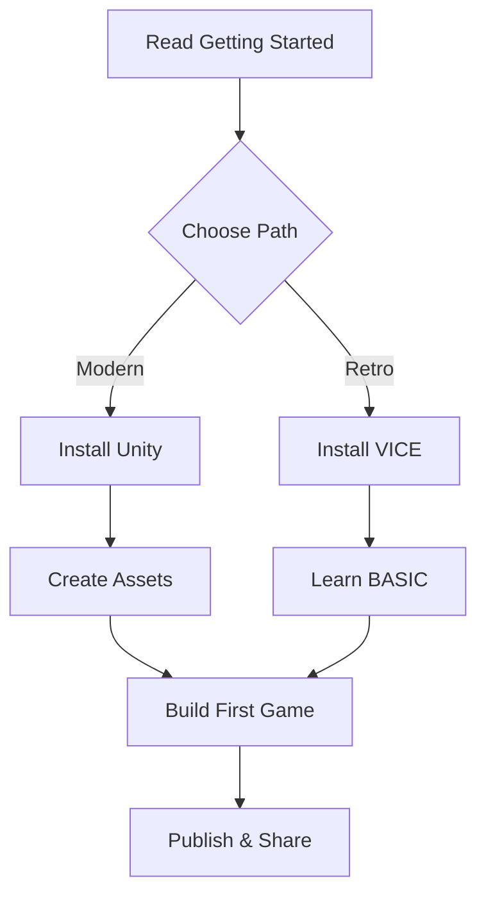

# Quick Reference Card

## 🚀 Quick Start Paths

### Path 1: Complete Beginner (2-4 hours to first game)
```
1. Read: docs/GETTING_STARTED.md
2. Install: Unity (modern-dev/unity/README.md)
3. Assets: Use Piskel (assets/README.md)
4. Music: Use BeepBox (audio/README.md)
5. Build: tutorials/modern-first-game.md
```

### Path 2: Retro Platform (1-2 weeks)
```
1. Read: docs/GETTING_STARTED.md
2. Install: WinVICE (emulators/README.md)
3. Learn: tutorials/c64-basics.md
4. Create: Simple BASIC game
5. Advance: Learn assembly
```

### Path 3: Experienced Developer (2-4 hours)
```
1. Choose: modern-dev/README.md
2. Setup: Unity/Godot/VS
3. Study: examples/README.md
4. Build: Your own game
```

## 📁 Directory Guide

```
retromista/
├── 📖 docs/                    # Start here!
│   ├── GETTING_STARTED.md     # → New users start here
│   ├── FAQ.md                 # → Common questions
│   └── TROUBLESHOOTING.md     # → Fix problems
│
├── 🎮 Development Paths
│   ├── emulators/             # Classic platforms
│   │   └── README.md          # → C64, Amiga, Arcade
│   ├── modern-dev/            # Modern engines
│   │   ├── unity/             # → Easiest for beginners
│   │   ├── godot/             # → Free & open source
│   │   └── visual-studio/     # → Advanced users
│   └── tutorials/             # Step-by-step guides
│       ├── c64-basics.md      # → C64 programming
│       └── modern-first-game.md # → Unity tutorial
│
├── 🎨 Asset Creation (No design skills!)
│   ├── assets/README.md       # → Graphics guide
│   └── audio/README.md        # → Music & SFX guide
│
├── 📦 Resources
│   ├── examples/              # Ready-to-run examples
│   ├── tools/                 # Tool recommendations
│   └── CONTRIBUTING.md        # How to contribute
│
└── README.md                  # Project overview
```

## 🛠️ Essential Tools

### For Beginners (All Free!)
| Task | Tool | Platform |
|------|------|----------|
| Game Engine | Unity | Windows/Mac/Linux |
| Pixel Art | Piskel | Browser |
| Music | BeepBox | Browser |
| Sound FX | Bfxr | Browser |

### Links
- Unity: https://unity.com/download
- Piskel: https://piskelapp.com
- BeepBox: https://beepbox.co
- Bfxr: https://bfxr.net

## 🎯 What Can I Build?

### Beginner Games (2-4 hours each)
- ⭐ Pong
- ⭐ Breakout/Arkanoid
- ⭐ Flappy Bird clone

### Intermediate Games (1-2 days each)
- ⭐⭐ Space Invaders
- ⭐⭐ Platformer basics
- ⭐⭐ Simple shooter

### Advanced Games (1-2 weeks each)
- ⭐⭐⭐ Pac-Man style maze
- ⭐⭐⭐ Complex platformer
- ⭐⭐⭐ Retro RPG

## 📚 Learning Sequence



### Week-by-Week Plan
**Week 1:** Setup & basics
- Day 1-2: Install tools
- Day 3-4: First tutorial
- Day 5-7: Simple Pong game

**Week 2:** Learn & build
- Day 1-3: Asset creation
- Day 4-5: Music & SFX
- Day 6-7: Breakout game

**Week 3:** Create original
- Day 1-3: Design your game
- Day 4-6: Build it
- Day 7: Polish & publish

## 🎨 Asset Creation Workflow

### Graphics (15 minutes)
```
1. Open Piskel (browser)
2. Create 16x16 canvas
3. Choose C64 palette (4 colors)
4. Draw simple sprite
5. Export as PNG
6. Import to Unity
```

### Music (15 minutes)
```
1. Open BeepBox (browser)
2. Choose "Chip" preset
3. Click squares to add notes
4. Create 4-bar loop
5. Export as WAV
6. Import to Unity
```

### Sound FX (5 minutes)
```
1. Open Bfxr (browser)
2. Click preset (Jump/Coin/Hit)
3. Click "Randomize"
4. Adjust if needed
5. Export as WAV
6. Import to Unity
```

## 🐛 Common Issues

### Unity Problems
- **Sprite blurry?** → Filter Mode: Point, Compression: None
- **Player falls through floor?** → Add Collider2D to both
- **Build fails?** → Add scene to Build Settings

### C64 Problems
- **VICE won't start?** → Run x64sc.exe
- **Can't load program?** → File → Autostart Disk Image
- **Too slow?** → Move from BASIC to Assembly

### Asset Problems
- **Can't draw?** → Start with simple shapes
- **No music ideas?** → Use BeepBox randomize
- **File too large?** → Use smaller resolution

See [docs/TROUBLESHOOTING.md](docs/TROUBLESHOOTING.md) for more!

## 💡 Pro Tips

### For Beginners
1. ✅ Start VERY simple (Pong is perfect)
2. ✅ Finish small projects first
3. ✅ Use free assets to start
4. ✅ Focus on gameplay, not graphics
5. ✅ Share early, get feedback

### For Intermediate
1. ✅ Study classic game mechanics
2. ✅ Build reusable systems
3. ✅ Learn one new technique per project
4. ✅ Contribute to open source
5. ✅ Join game jams

### For Advanced
1. ✅ Profile and optimize
2. ✅ Write clean, documented code
3. ✅ Create tools for your workflow
4. ✅ Mentor beginners
5. ✅ Share knowledge

## 🔗 Quick Links

### Documentation
- [Getting Started](docs/GETTING_STARTED.md)
- [FAQ](docs/FAQ.md)
- [Troubleshooting](docs/TROUBLESHOOTING.md)

### Guides
- [Unity Setup](modern-dev/unity/README.md)
- [Godot Setup](modern-dev/godot/README.md)
- [C64 Basics](tutorials/c64-basics.md)
- [Asset Creation](assets/README.md)
- [Audio Creation](audio/README.md)

### Resources
- [Tools List](tools/README.md)
- [Examples](examples/README.md)
- [Contributing](CONTRIBUTING.md)

## 🆘 Need Help?

1. Check [FAQ](docs/FAQ.md)
2. Read [Troubleshooting](docs/TROUBLESHOOTING.md)
3. Search existing [Issues](https://github.com/mistalan/retromista/issues)
4. Ask in [Discussions](https://github.com/mistalan/retromista/discussions)
5. Create new Issue with details

## 📊 Comparison Chart

### Engines
| Engine | Free? | Difficulty | Best For |
|--------|-------|------------|----------|
| Unity | Yes | Easy | Beginners |
| Godot | Yes | Easy | Open source fans |
| VS+SDL2 | Yes | Hard | Advanced users |

### Platforms
| Platform | Difficulty | Learning Time |
|----------|------------|---------------|
| C64 | Medium | 1-2 weeks |
| Amiga | Hard | 2-4 weeks |
| Unity | Easy | 2-4 hours |
| Godot | Easy | 2-4 hours |

## 🎉 Success Checklist

- [ ] Tools installed
- [ ] First tutorial completed
- [ ] Simple game built
- [ ] Assets created
- [ ] Music added
- [ ] Game shared with community
- [ ] Started original project

## 📅 Recommended Timeline

**Day 1:** Read docs, install tools
**Day 2-3:** Complete first tutorial
**Day 4-7:** Build Pong clone
**Week 2:** Build Breakout
**Week 3:** Start original game
**Month 2:** Complete and publish!

---

**Print this card or keep it handy while developing!** 📋

For full documentation, see [README.md](README.md)
